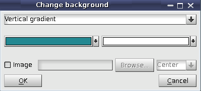
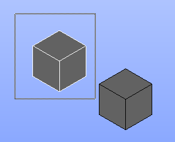
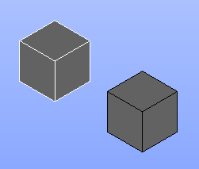
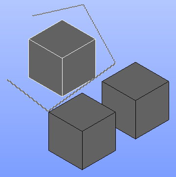
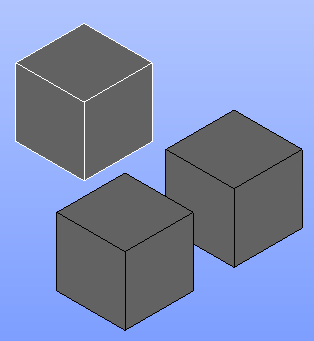
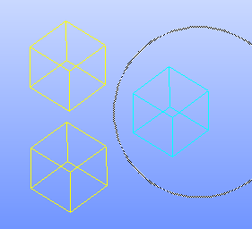
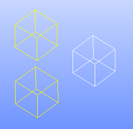

.. _common_functionality_page:

********************************************
Functionality common for OCC and VTK viewers
******************************************** 

.. _viewer_background:

Background
##########

Viewers background can be customized using the "Change background"
popup menu command that opens the following dialog box:

The following types of the background are supported:

* **Single color:** the background is colored with the solid color specified by the user in the dialog box.

* **Gradient background:** the background is gradiently colored according to two colors and the gradient type specified in the dialog box. The following types of background are supported:

  * Horizontal
  * Vertical
  * First diagonal
  * Second diagonal
  * First corner
  * Second corner
  * Third corner
  * Fourth corner

* **Image:** allows to set image as viewer background and define filling type:

  * **Center:** the image is located at the center of the viewer backgound
  * **Tile:** the image fills the entire viewer backgound one by one
  * **Stretch:** the image is stretched to the entire viewer backgound.

Default background for the OCC viewer is specified via the
:ref:`occ_preferences` and for the
VTK viewer via the :ref:`vtk_preferences`.

Selection
#########

An element can be selected by clicking on it with the left mouse button.
Selecting objects with locked *Shift* key produces a multi selection. 

Additionally, when the viewer owns an input focus, an object can be selected
by pressing *"S"* on the keyboard. Pressing *"S"* when holding
\em Shift key allows adding/removing an object to/from the current selection.

OCC viewer provides a way to navigate between the selectable objects. 
This feature (disabled by default) is used in some dialog boxes (for example, 
in Geometry module). When there are several objects which suit current
selection requirements (specified by the dialog) under the current mouse cursor,
it is possible to switch between them by means of mouse scroll wheel.
The same can be also done by pressing *"N"* and *"P"* keys.

There are also three additional selection mechanisms: rectangle, 
polyline and circle selection.

Rectangle selection
*******************

Rectangle Selection is the basic and commonly used selection tool.
 
To select a rectangle area press and hold the left mouse button while drawing the diagonal of the selection rectangle in the viewer.

As a result, the objects within the rectangle are selected.

.. note:: It is possible to add an area to the existing selection by holding down *Shift* key while selecting.

Polyline selection
******************

OCC and VTK Viewers feature a special Polyline Selection mechanism,
which allows selecting an arbitrary part of the graphic area using a
polygon frame (rubber band), instead of the usual selection with a
rectangular frame.

To produce a Polyline Selection in VTK Viewer, press and hold the right
mouse button and draw the first side of the selection polygon, then change
the direction by clicking the left mouse button add draw another side, etc.
Click twice by left mouse button to finish drawing.

To produce a Polyline Selection in OCC Viewer, press and hold the left
mouse button and draw the first side of the selection polygon, then change
the direction by clicking the Space keyboard button add draw another side, etc.
You can delete last polygon point by Backspace button.
To finish drawing use Enter (Return) key or put mouse cursor near the first
polygon point (you mouse cursor will have '+' shape in this case)
and click the Space or release the left mouse button.

As a result, the objects within the polygon are selected.

.. note:: To add an area to the existing selection it is necessary to hold down *Shift* key while selecting.

Circle selection
****************

To select a circular area press the left mouse button in the viewer at the
desired centre of the circle and hold it while you reach required circle radius.

As a result, the objects within the circle are selected.

.. note:: It is possible to add an area to the existing selection by holding down *Shift* key while selecting.

.. _viewer_navigation_modes:

Navigation modes
################

OCC and VTK 3D viewers support two different navigation modes:

* **Salome standard controls**
  Rectangle selection in this mode is performed by the left mouse button
  and polyline selection by the right mouse button;
  multiple selection is available when *Shift* button is pressed.

  Also, holding *Ctrl* key with pressed mouse buttons performs the following view transformations:

  * *Ctrl* + left mouse button - zooming;
  * *Ctrl* + middle mouse button - panning;
  * *Ctrl* + right mouse button - rotation.

* **Keyboard free style**

  This mode allows performing all view transformations without using the 
  keyboard (only by the mouse):

  * Left mouse button performs view rotation;
  * Middle mouse button performs panning; 
  * Right mouse button makes zooming.

  In this style rectangle selection is done by the left mouse button with *Ctrl* key pressed;
  polyline selection is done by the right mouse button with *Ctrl* key pressed.

In both styles selection of objects in the viewer can be performed by pressing
*"S"* key or by the left mouse button click. 

Zooming can be alternatively done by scrolling mouse wheel.

