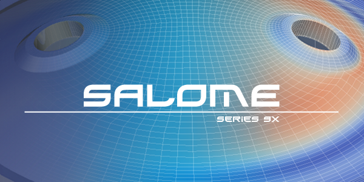
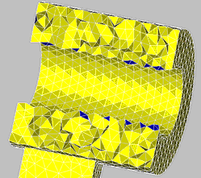

*******************************
Introduction to Salome Platform
*******************************

Welcome to SALOME Platform! Modern technological products (cars,
structures, electrical or electronic equipment) are getting more and
more complex every year and must meet increasingly severe requirements
in terms of quality and performance. For example, for structures and
their environment the demands to reduce risks and optimize costs are
extremely high. It requires particularly refined simulations
concerning structural behavior and robustness to ensure high
reliability.

The numeric modeling of a physical problem, the development of
solutions and their integration into the design process are often
handled in very specific environments. SALOME represents a generic
CAD-based application for digital simulation with "high reactivity to
market evolutions and customer expectations".

SALOME is a free software that provides a generic platform for Pre and
Post-Processing for numerical simulation. It is based on an open and
flexible architecture made of reusable components available as free
software.

SALOME is a CAD/CAE integration platform. It provides reusable
components for: 

#. 3D modeling (bottom-up construction, import, healing);
#. Visualization;
#. Computational schemas management;
#. Post-processing.

SALOME is tailored for integration of custom components:

#. CAD interfaces;
#. Mesh generators;
#. Finite Element solvers with specific pre-processors.

The SALOME platform is available in Open Source.

**Salome Platform:**

#. Supports interoperability between CAD modeling and computation software (CAD-CAE link) 
#. Makes easier the integration of new components on heterogeneous systems for numerical computation 
#. Sets the priority to multi-physics coupling between computation software 
#. Provides a generic user interface, user-friendly and efficient, which helps to reduce the costs and delays of carrying out the studies 
#. Reduces training time to the specific time for learning the software solution which has been based on this platform 
#. All functionalities are accessible through the programmatic integrated Python console

**What can you do in SALOME? (Some of SALOME main functions)**

#. Define geometrical models (create/modify geometrical items), import and export them using the BREP, IGES and STEP formats; 
#. Define meshing of these geometrical items, import and export them;
#. Handle physical properties and quantities attached to geometrical items, import and export them to a reusable format;
#. Perform computations using a solver (optionally provided): read input data, configure the solver, and write calculation results);
#. Visualize result fields in 3D, 2D and export images of their visualization to an appropriate format;
#. Manage study schemes: definition, save/restore;
#. Manage computation schemes: definition, execution.

This part of documentation on Salome also covers 
:ref:`introduction_to_gui_page`, common for all modules, such as study management, Salome viewers,
preferences, etc.

And finally, there is an additional chapter, which provides a short
guide about the :ref:`tui_page` to access SALOME GUI
functionalities from the Python code.

.. toctree::

	introduction_to_gui.rst
	text_user_interface.rst
