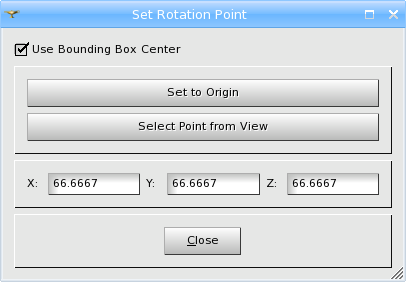
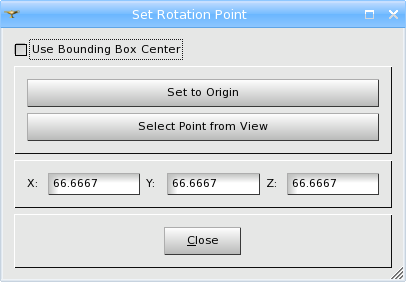
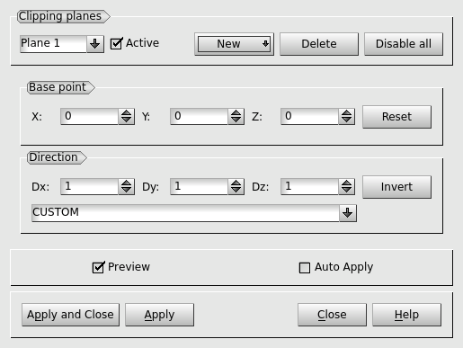
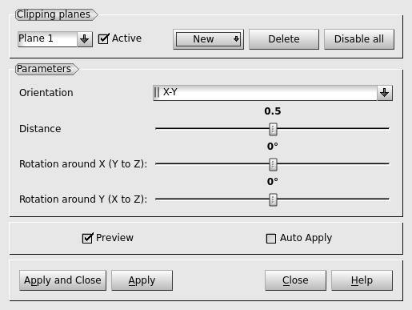
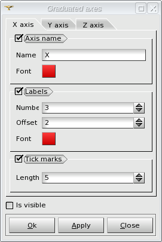
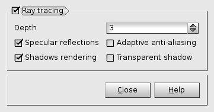
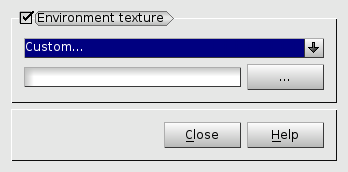
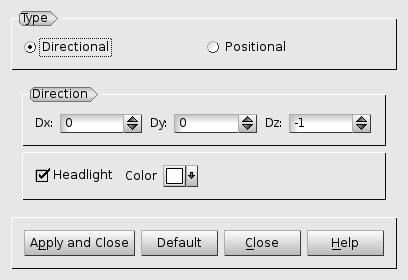
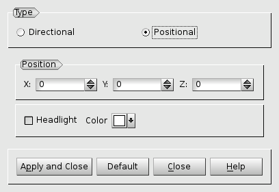

.. _occ_3d_viewer_page: 

*************
OCC 3D Viewer
*************

Operations
##########

The functionalities of OCC viewer are available via its Viewer
Toolbar. Buttons marked with small downward triangles have extended
functionality which can be accessed by locking on them with left mouse
button.

.. image:: ../images/occviewer_toolbar.png
	:align: center

____

.. image:: ../../../../src/OCCViewer/resources/occ_view_camera_dump.png
	:align: center

**Dump View** - exports an object from the viewer in bmp, png, jpeg or another image format.

____

.. image:: ../../../../src/OCCViewer/resources/occ_view_style_switch.png
	:align: center

**Interaction style switch** - allows to switch between standard
and "keyboard free" interaction styles. "Keyboard free" style allows
to process all view transformations without using keyboard (only by
mouse). By default, rotation in this mode is performed by left mouse
button, panning - by middle mouse button, zooming - by right mouse 
button. Selection in view by pressing "s" key works in both
styles.

____

.. image:: ../../../../src/OCCViewer/resources/occ_view_zooming_style_switch.png
	:align: center

**Zooming style switch** - allows to switch between standard
(zooming at the center of the view) and advanced (zooming at the
current cursor position) zooming styles.

____

.. image:: ../../../../src/OCCViewer/resources/occ_view_triedre.png
	:align: center

**Show/Hide Trihedron** - shows or hides coordinate axes.

____

.. image:: ../../../../src/OCCViewer/resources/occ_view_preselection.png
	:align: center

**Enable/Disable preselection** - enables or disables preselection (highlighting) in the view.

____

.. image:: ../../../../src/OCCViewer/resources/occ_view_selection.png
	:align: center

**Enable/Disable selection** - enables or disables selection in the view.

____

**Advanced selection by polygon** - enables advanced selection by polygon.

____

**Advanced selection by circle** - enables advanced selection by circle.

____

.. image:: ../../../../src/OCCViewer/resources/occ_view_fitall.png
	:align: center

**Fit all** - represents all displayed objects in the
visible area.

____

.. image:: ../../../../src/OCCViewer/resources/occ_view_fitarea.png
	:align: center

**Fit area** - resizes the view to place in the visible area only
the contents of a frame drawn with pressed left mouse button.

____

**Fit selection** - fits view contents to the current selection.

____

.. image:: ../../../../src/OCCViewer/resources/occ_view_zoom.png
	:align: center

**Zoom** - allows to zoom in and out.

____

.. image:: ../../../../src/OCCViewer/resources/occ_view_pan.png
	:align: center

**Panning** - if the represented objects are greater that the
visible area and you don't wish to use **Fit all** functionality,
click on this button and you'll be able to drag the scene to see its
remote parts.

____

.. image:: ../../../../src/OCCViewer/resources/occ_view_glpan.png
	:align: center

**Global panning** - allows to select a point to be the center of a scene
representing all displayed objects in the visible area.

____

.. image:: ../../../../src/OCCViewer/resources/occ_view_rotation_point.png
	:align: center

**Change rotation point** - allows to choose the point around
which the rotation is performed.

By default the rotation point is located in the Center of the bounding
box of represented objects.

Unchecking **Use Bounding Box Center** check-box allows you to
change rotation point:

- **Set to Origin** button sets the rotation point to origin of coordinates: (0, 0, 0).
- **Gravity Center of Selected Object** button allows using the gravity center of the object selected in the viewer as the center of the rotation point. When you click this button, you should first choose the type of selectable object: Point, Edge, Face or Solid and only then proceed with selection in the viewer.
- Also you can define the coordinates of the rotation point manually.

____

.. image:: ../../../../src/OCCViewer/resources/occ_view_rotate.png
	:align: center

**Rotation** - allows to rotate the scene using the mouse.

____

.. image:: ../../../../src/OCCViewer/resources/occ_view_front.png
	:align: center

.. image:: ../../../../src/OCCViewer/resources/occ_view_back.png
	:align: center

.. image:: ../../../../src/OCCViewer/resources/occ_view_top.png
	:align: center

.. image:: ../../../../src/OCCViewer/resources/occ_view_bottom.png
	:align: center

.. image:: ../../../../src/OCCViewer/resources/occ_view_left.png
	:align: center

.. image:: ../../../../src/OCCViewer/resources/occ_view_right.png
	:align: center

These buttons orientate the scene strictly about coordinate axes:
**Front**, **Back**, **Top**, **Bottom**, **Left** or **Right** side.

____

.. image:: ../../../../src/OCCViewer/resources/occ_view_anticlockwise.png
	:align: center

**Rotate counterclockwise** - rotates view 90 @htmlonly &deg; @endhtmlonly counterclockwise.

____

.. image:: ../../../../src/OCCViewer/resources/occ_view_clockwise.png
	:align: center

**Rotate clockwise** - rotates view 90 @htmlonly &deg; @endhtmlonly clockwise.

____

.. image:: ../../../../src/OCCViewer/resources/occ_view_orthographic.png
	:align: center

**Ortographic projection** - default OCC viewer projection mode.

____

.. image:: ../../../../src/OCCViewer/resources/occ_view_perspective.png
	:align: center

**Perspective projection** - perspective OCC viewer projection mode.

____

.. image:: ../../../../src/OCCViewer/resources/occ_view_stereo.png
	:align: center

**Stereo projection** - stereoscopic rendering of the view.
.. note:: Activation of this mode also switches the view to perpective projection in case if the orthographic one has been active.
.. note:: By default, quad-buffered stereo is activated, if it is supported by the graphic card. If no stereo capabilities are available, an error message is shown.
.. note:: The stereoscopic view settings can be defined in :ref:`occ_preferences` preferences.

____

.. image:: ../../../../src/OCCViewer/resources/occ_view_reset.png
	:align: center

**Reset** - restores the default position (isometric) of objects in
the scene.

____

.. image:: ../../../../src/OCCViewer/resources/occ_view_shoot.png
	:align: center

**Memorize view** - saves the current position of objects in the
scene.

____

.. image:: ../../../../src/OCCViewer/resources/occ_view_presets.png
	:align: center

**Restore view** - restores the saved position of objects in the
scene.

____

.. image:: ../../../../src/OCCViewer/resources/occ_view_clone.png
	:align: center

**Clone view** - opens a new duplicate scene.

____

.. _clipping_planes:

Clipping Planes
###############

**Clipping** allows creating cross-section views (clipping planes)
of your mesh.

To create a clipping plane, click on the **New** button in the dialog and choose how it will be defined by **Absolute** or **Relative** coordinates.

**Absolute Coordinates**

- **Base point** - allows defining the coordinates of the base point for the clipping plane.

  - **Reset** - returns the base point to coordinate origin.

- **Direction** - allows defining the orientation of the clipping plane.

	- **Invert** - allows selecting, which part of the object will be removed and which will remain after clipping.

    
**Relative mode**  

- **Orientation** ( ||X-Y, ||X-Z or ||Y-Z).

- **Distance** between the opposite extremities of the boundary box of represented objects, if it is set to 0.5 the boundary box is split in two halves.

- **Rotation** (in angle degrees) **around X** (Y to Z) and **around Y** (X to Z) (depending on the chosen Orientation)

The other parameters are available in both modes : 

- **Active** checkbox is used to apply/erase current plane and it's affect to/from view.
- **Delete** removes the active clipping plane and discards it's view changes.
- **Disable all** deactivates all created clipping planes and clears **Auto Apply** checkbox.
- **Preview** check-box shows the clipping plane in the **3D Viewer**.
- **Auto Apply** check-box allows you to see the result of clipping in the **3D Viewer** immediately. Be careful, it is not a preview 2and Close button could not cancel the applied modifications.

It is also possible to interact with the clipping plane directly in 3D 
view using the mouse. 

____

.. image:: ../../../../src/OCCViewer/resources/occ_view_scaling.png
	:align: center

**Scaling** - represents objects deformed (stretched or stuffed)
along the axes of coordinates.

____

.. image:: ../../../../src/OCCViewer/resources/occ_view_graduated_axes.png
	:align: center

**Graduated axes** - allows to define axes parameters and graduate
them.

- **Axis name** - if checked the axis name is displayed in the viewer.

  - **Name** - allows to redefine the axis name.

  - **Font** - allows to define the font color of the axis name.

- **Labels** - if checked the labels are displayed in the viewer.

  - **Number** - allows to define the number of labels.

  - **Offset** - allows to define the distance between axis and labels.

  - **Font** - allows to define the font color of labels names.

- **Tick marks** - if checked the tick marks are displayed in the viewer.

  - **Length** - allows to define the length of tick marks.

- **Is visible** - if checked the graduated axes are displayed in the viewer.

____

.. image:: ../../../../src/OCCViewer/resources/occ_view_ambient.png
	:align: center

**Toggle ambient light** - toggle "keep only ambient light" flag
on/off.

____

.. image:: ../../../../src/OCCViewer/resources/occ_view_minimized.png
	:align: center

|

.. image:: ../../../../src/OCCViewer/resources/occ_view_maximized.png
	:align: center

**Minimize/Maximize** - these buttons allow switching the current
view area to the minimized / maximized state.

____

.. image:: ../../../../src/OCCViewer/resources/occ_view_return_3d_view.png
	:align: center

**Return to 3D** - this button switches from 2D view projection back to the 3D view mode.

____

.. image:: ../images/occ_view_sync.png
	:align: center

**Synchronize view** - allows to synchronize 3d view
parameters. This button has two states - checked and
unchecked. Clicking on this button opens a drop-down menu listing the
compatible 3d views. As soon as the user selects any view from the
list, the parameters (view point, position, zoom coefficient, etc.) of
the current view are synchronized with the selected view (static
synchronization).

In addition, when this button is in the "checked" state, the dynamic
synchronization of the views is performed, i.e. any zoom, pan, rotate
or other view operation done in one view is automatically applied to
the other view.

____

.. _ray_tracing:

Ray tracing
===========

**Ray tracing** - allows to switch between rendering methods in run-time 
in the current OCCT 3D view. It can be used to produce images with photorealistic quality.

- **Ray tracing** - specifies rendering mode: OpenGL rasterization (by default) or GPU ray-tracing.

  - **Depth** - defines maximum ray-tracing depth.
  
  - **Specular reflections** - enables/disables specular reflections.
  
  - **Adaptive anti-aliasing** - enables/disables adaptive anti-aliasing.
    
  - **Shadows rendering** - enables/disables shadows rendering.
  
  - **Transparent shadow** - enables/disables light propagation through transparent media.
  
____

.. _env_texture:

Environment texture
###################

**Environment texture** - allows to set parameters for environment texture.
This is a special mode of texture mapping when specular reflection of environment texture 
is simulated by OpenGL using a special texture coordinates generation algorithm (a sphere map).

- **Environment texture** - enables/disables environment texture in the current OCCT 3D view.

User can select one of 7 predefined environment texture from the list or define its texture from file by 
choosing item **"Custom..."** in a combo box.

.. note:: 
	Environment texture file should normally satisfy the following requirements in order to produce good visual result:
		* The image file should have 2:1 width-to-height ratio.
		* It should constitute a 360-degrees panoramic image created using a fish-eye lens. 

____

.. _light_source:

Light source
============

**Light source** - allows to set parameters for light source.

It's possible to choose a type of light source between directional and positional light.

**Directional** light - creates a directional light source in the viewer.
It is defined by direction coordinates, color and headlight parameter.

**Positional** light - creates an isolated light source X,Y,Z in the viewer. 
It is also defined by the color and headlight parameter.

Click:

- **Apply and Close** to apply defined light source to the OCC 3D Viewer.

- **Default** to restore default values of light source.

- **Close** to return parameters of light source on initial values.

