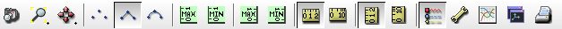
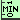
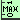
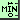
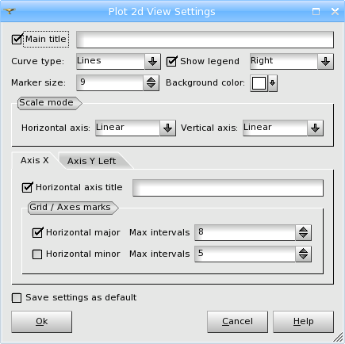
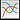

.. _plot2d_viewer_page:

**************
Plot 2D viewer
**************

The functionalities of Plot2d viewer are available via its Viewer
Toolbar. Buttons marked with small downward triangles have extended
functionality which can be accessed by locking on them with left mouse
button.

____

.. image:: ../../../../src/Plot2d/resources/plot2d_camera_dump.png
	:align: center

**Dump View** - exports an object from the viewer in
bmp, png or jpeg image format.

____

.. image:: ../../../../src/Plot2d/resources/plot2d_fitall.png
	:align: center

**Fit all** - scales the display to show the entire scene. Use this
to resize the scene so that it could fit within the Viewer boundary.

____

.. image:: ../../../../src/Plot2d/resources/plot2d_fitarea.png
	:align: center

**Fit area** - resizes the view to place in the visible area only
the contents of a frame drawn with pressed left mouse button.

____

.. image:: ../../../../src/Plot2d/resources/plot2d_zoom.png
	:align: center

**Zoom** - allows to zoom in and out.

____

.. image:: ../../../../src/Plot2d/resources/plot2d_pan.png
	:align: center

**Panning** - if the represented objects are greater that the visible
area and you don't wish to use Fit all functionality, click on this
button and you'll be able to drag the scene to see its remote parts.

____

.. image:: ../../../../src/Plot2d/resources/plot2d_glpan.png
	:align: center

**Global panning** - allows to define the center of the scene
presenting all displayed objects in the visible area.

____

.. image:: ../../../../src/Plot2d/resources/plot2d_points.png
	:align: center

**Draw Points** - switches display mode to *Points*. In
this mode, each curve is displayed as a set of points.

____

.. image:: ../../../../src/Plot2d/resources/plot2d_lines.png
	:align: center

**Draw Lines** - switches display mode to *Lines*. In this
mode, each curve is represented as a set of plain line segments.

____

.. image:: ../../../../src/Plot2d/resources/plot2d_splines.png
	:align: center

**Draw Splines** - switches display mode to *Splines*. In
this mode, each curve is represented as a spline.

____

**Normalization to global minimum by left Y axis** - switches
normalization mode to **Left Y Axis: Minimum normalization**.
In this mode, all curves are normalized to the global minimum by the left Y axis.

**Normalization to global maximum by left Y axis** - switches
normalization mode to **Left Y Axis: Maximum normalization**.
In this mode, all curves are normalized to the global maximum by the left Y axis.

____

**Normalization to global minimum by right Y axis** - switches
normalization mode to **Right Y Axis: Minimum normalization**.
In this mode, all curves are normalized to the global minimum by
the right Y axis.

.. image:: ../../../../src/Plot2d/resources/plot2d_rmax_normalization.png
	:align: center

**Normalization to global maximum by right Y axis** - switch
normalization mode to **Right Y Axis: Maximum normalization**.
In this mode, all curves are normalized to the global maximum by
the right Y axis.

____

.. image:: ../../../../src/Plot2d/resources/plot2d_linear.png
	:align: center

|

.. image:: ../../../../src/Plot2d/resources/plot2d_log.png
	:align: center

These buttons allow to switch horizontal axis scale to the linear or
logarithmic mode.

.. note::
	The logarithmic mode of the horizontal axis scale is allowed only if the minimum value of abscissa component of displayed points is greater than zero.

____

.. image:: ../../../../src/Plot2d/resources/plot2d_linear_y.png
	:align: center

|

.. image:: ../../../../src/Plot2d/resources/plot2d_log_y.png
	:align: center

These buttons allow to switch vertical axis scale to the linear or
logarithmic mode.

.. note::
	The logarithmic mode of the vertical axis scale is allowed only if the minimum value of ordinate component of displayed points is greater than zero.

____

.. image:: ../../../../src/Plot2d/resources/plot2d_legend.png
	:align: center

**Show Legend** - Shows / hides information about the displayed
objects in a legend.

____

.. image:: ../../../../src/Plot2d/resources/plot2d_settings.png
	:align: center

**Settings** - provides an access to the settings dialog box, that
allows to specify advanced parameters for the Plot 2d Viewer.

.. _settings:

Settings
========

The following options are available:

- **Main title** is the XY plot title. By default, it contains the names of tables, from which the curve
  lines are constructed.

- **Curve type** allows selecting from *Points*, *Lines* or *Spline*.

- **Marker size** - size of the points (markers) forming curve lines.

- **Background color** of the XY plot.

- **Selection color** - defines the color of selected object in the viewer.

- **Legend** specifies the legend properties.

  - **Show legend** - specifies if the legend is shown by default.

  - **Legend Position** allows positioning the description table on XY plot (to the *Left*, to the *Right*,  on *Top* or on *Bottom*).

  - **Symbol type** allows positioning the legend item symbol: "Marker on line" or "Marker above line".

  - **Legend font** allows setting font variant, size and style for legend items.

  - **Legend font color** allows selecting the font color for legend items.

  - **Highlighted legend font color** allows selecting font color for selected legend items.

- **Deviation marker** specifies the properties of the marker, which is used for drawing deviations data.

  - **Line width** line width of the marker.

  - **Tick size** size of the upper and lower horizontal lines of the marker.

  - **Color** color of the marker.

- **Normalization** allows selecting the type of
  normalization (*minimum* or/and *maximum*) for the displayed
  presentations of 2d curves in the view.

- **Scale mode** allows selecting the type of scaling (*Linear*
  or *Logarithmic*) for **X (Horizontal)** or **Y (Vertical)**
  axes separately. Note that the *Logarithmic* scale can be used
  only if the minimum value of corresponding component (abscissa or
  ordinate) of all points displayed in the viewer is greater than
  zero.

- **Axis ...** options group allows specifying additional settings
  for each axis separately:

  - **Axis title** - an axis title.

  - **Grid / Axes marks** allows defining the maximum number
    of major and minor scale divisions for a given axis. The real
    number of intervals fits to {1,2,5}*10^N, where N is a natural
    number, and does not exceed the maximum.

- **Save settings as default** If this check box is marked, all XY
  plots will be displayed with these defined properties.

____

.. _analytical_curve:

Analytical curves
=================

**Analytical curves** - provides an access to the analytical curves
dialog box that allows to add, remove and modify analytical curves
for the Plot 2d Viewer.

.. image:: ../images/analytical_curves_dlg.png
	:align: center

The options are as follows:

- Curve parameters:

  - **y(x)=** allows specifying a python expression, which is used to
    calculate the coordinates of the curve points, where **x**
    corresponds to the horizontal range, shown in plot 2D viewer.

  - **Nb. itervals** allows specifying the number of the curve points.

- Curve properties:

  - **Auto assign** if checked, the properties
    (*Line type*, *Line width*, *Marker type* and
    *Color*) are assigned to curves automatically. To define
    the curve properties manually, uncheck this control.

  - **Line type** allows to choose curve line type from *None*,
    *Solid*, *Dash*, *Dot*, *Dash - Dot* and
    *Dash - Dot - Dot*.

  - **Line width** allows to specify line width of the curve.

  - **Marker type** allows to choose curve marker type from
    *Circle*, *Rectangle*, *Diamond*, *Rightward Triangle*,
    *Leftward Triangle*, *Downward Triangle*,
    *Upward Triangle*, *Cross* and *Diagonal Cross*).

  - **Color** allows specifying the curve color.

____

.. image:: ../../../../src/Plot2d/resources/plot2d_clone.png
	:align: center

**Clone view** - opens a new duplicate scene.

____

**Print view** - prints the current view scene.

