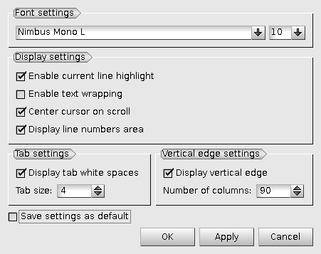

.. _python_viewer_page:

*************
Python viewer
*************

The functionalities of Python viewer are available via its Toolbar.

____

**New** - clears the viewer to create a new script. If viewer was modified, you will be asked to close it before removing.

____

**Open** - allows opening an existing script by browsing for it in a standard **Open File** dialog box, choosing the required .py file and clicking **Open** button. If there is an already opened script, you will be asked to close it before opening new one.

____

**Save** - saves the current script.

.. note::
	If the script has not been previously saved, Save calls the standard **Save File** dialog, where you can enter the script name and save it.

____

**Save As...** - allows saving the current script with a new name. Input a new name for the script in the standard **Save file as ** dialog box and click **Save** button.

____

**Undo** - undoes the last action in Python viewer.

____

**Redo** - redoes the previously undone action in Python viewer.

____

**Cut** - saves the selected text into the clipboard and removes it from the viewer.

____

.. image:: ../images/python_copy.png
	:align: center

**Copy** - saves the selected text into the clipboard.

____

**Paste** - restores the saved text from the clipboard.

____

**Delete** - removes the selected text.

____

**Select All** - selects the whole text.

____

**Preferences** - provides  access to the preferences dialog box, that allows specifying advanced parameters for the Python Viewer.

.. _custom_python_preferences:

Custom Python preferences
=========================

The following options are available:

- **Font settings** allows setting font variant and its size.

- **Display settings** specifies the script representation in the viewer:

  - **Enable current line highlight** switches on background coloring of the current line.
  - **Enable text wrapping** wraps lines at the view border of the editor.
  - **Center cursor on scroll** scrolls the script vertically to make the cursor visible at the center of the viewer.
  - **Display line numbers area** shows a panel with line numbers of the script at the left border of the editor.

- **Tab settings** allows displaying tab indentation as a certain number of white-spaces.

- **Vertical edge settings** manages drawing of a vertical line at the specified column of the viewer.

- **Save settings as default** button stores the applied Python viewer settings in the SALOME preferences .xml file. The settings will be restored in the current and next SALOME sessions.

The buttons in in the bottom part of dialog box peform the following actions:

- **OK** button applies preferences to the editor;

- **Cancel** button rejects changes;

- **Defaults** button restores preferences from applicaion's defaults;

- **Help** button opens Help browser.

