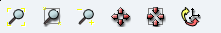

.. _qxscene_2d_viewer_page:

*****************
QxScene 2D Viewer
*****************

Operations
##########

The functionalities of QxScene viewer are available via its Viewer
Toolbar. Buttons marked with small downward triangles have extended
functionality which can be accessed by locking on them with left mouse
button.

____

.. image:: ../../../../src/QxScene/resources/qx_view_fitall.png
	:align: center

**Fit all** - scales the presentation so that it could fit within
the Viewer boundaries.

____

.. image:: ../../../../src/QxScene/resources/qx_view_fitarea.png
	:align: center

**Fit area** - resizes the view to place in the visible area only
the contents of a frame drawn with pressed left mouse button.

____

.. image:: ../../../../src/QxScene/resources/qx_view_zoom.png
	:align: center

**Zoom** - allows to zoom in and out.

____

.. image:: ../../../../src/QxScene/resources/qx_view_pan.png
	:align: center

**Panning** - if the represented objects are greater that the
visible area and you don't wish to use **Fit all** functionality,
click on this button and you'll be able to drag the scene to see its
remote parts.

____

.. image:: ../../../../src/QxScene/resources/qx_view_glpan.png
	:align: center

**Global panning** - allows to select a point to be the center of
the presentation showing all displayed objects in the visible ares.

____

.. image:: ../../../../src/QxScene/resources/qx_view_reset.png
	:align: center

**Reset** - restores the default position the scene.

____

For more details about QxScene viewer, refer to the **Help > User's guide > YACS module**.

