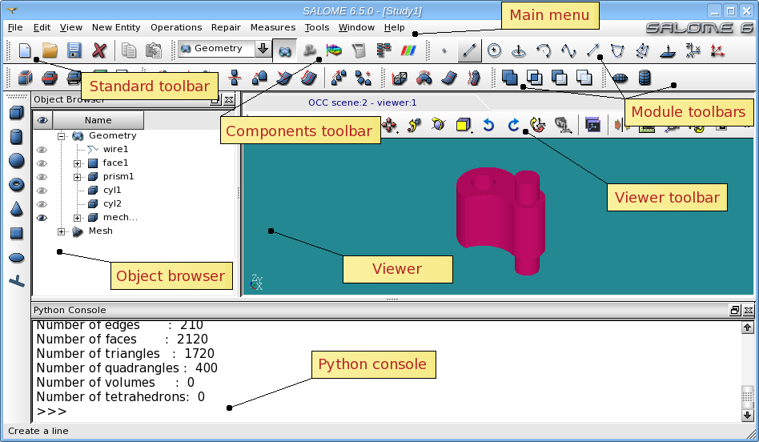
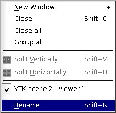
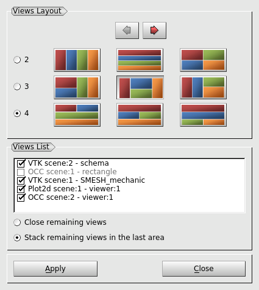

.. _salome_desktop_page:

**************
SALOME desktop
**************

SALOME applies **Single Document Interface** (SDI) approach. Only one 
:ref:`study_management_page` "study (document)" can be opened at any given moment.

The front-end of the application is a single Desktop top-level window
that embeds all GUI operations. The desktop window provides access to standard GUI elements,
such as viewers, main menu, toolbars, dockable windows, dialog boxes, etc. 

The main elements of the SALOME Desktop are represented on the picture below:

The main parts of the SALOME Desktop are:

* **Main menu** - This is a set of context-sensitive menus updated according to the functionality of the currently active component. In general, these menus contain all functional options of SALOME platform.
* **Standard toolbar** - contains standard actions that allow creating new or opening existing study, saving study, deleting objects, etc.
* **Components toolbar** - allows activating components in SALOME platform.
* **Module toolbars** - contain actions specific to the currently active module.
* **Viewer toolbar** - provides a set of tools destined for visualization of the presentations in the viewer.

All toolbars in the **SALOME** Platform are context-sensitive. Loading of a definite component
(Geometry, Mesh etc.) will automatically add some additional
toolbars specific to this component. To display/hide a toolbar, in the main menu choose **View > Toolbars**, and from this submenu check or uncheck the toolbar that you would like to display/hide.

By default all toolbars are located on top of the SALOME desktop, but you can relocate a toolbar by dragging it with the mouse and dropping in any place of the window.

Parts of the study window:

* **Object browser** - Management of objects created or imported into SALOME application.
* **Viewer** - This window is destined for visualization of presentations.
* **Python console** - Window for Python interpreter. This window functions like a standard document: the pop-up menu invoked by right-click in this window gives access to **Copy/Paste/SelectAll/ClearAll** options.

Object Browser, Python Console, MenuBar, etc are, in fact, separate dockable windows.
Dockable windows can be placed in special areas, on the borders of
desktop like toolbars. You can change the size and the position of
dockable windows, hide them or even place outside desktop. SALOME
saves in the same file all positions and sizes of dockable windows. It
means that the difference in settings of the same windows (for example
Python console) is possible between different modules (the same window
can have different size and position when other module is
activated). Also each module can indicate which common windows are
necessary for working, and only they will be displayed when this
module is active.

All parts of Salome desktop and study window can be managed through **View** menu.

.. image:: ../images/viewmenu.png
	:align: center

- **Toolbars** - allows to show and hide toolbars.
- **Windows** - allows to show and hide dockable windows, such as Object Browser and Python Console.
- **Status Bar** allows showing and hiding the Status Bar.
- :ref:`themes_page` - allows to select and edit the style (colors and fonts) for Salome session.

If there are several viewer windows in your current study and you want to display more then one at the same time, you can use the functionalities provided by the **Window** menu.

- **New window** - allows to open a new instance of any viewer.
- **Close** - closes the currently active viewer window.
- **Close all** - closes all viewer windows.
- **Group all** - arranges all created viewer windows on the same desktop.
- **Arrange Views** - allows choosing the necessary views and their layout (see image below).

  - The radio-buttons in **Views Layout** section allow choosing the number of views to be arranged (2, 3 or 4). The buttons with images allow choosing the view layout (depending on the chosen number of views). 
  - **Views List**  contains the list of opened view windows, where it is possible to check in the necessary views. 
  - **Close the remaining views** check-box allows closing all non-selected views.    
  - **Stack the remaining views** check-box allows stacking all non-selected views in the last tab area.

- **Split Vertically** and **Split Horizontally** allow splitting the representation area into two parts, in horizontal or vertical direction.
- List of all opened viewer windows provides fast access to them.
- **Rename** - allows renaming the currently selected viewer window.

