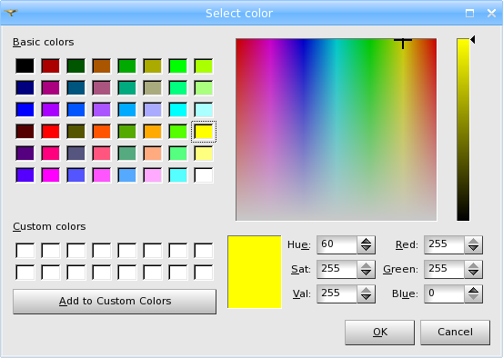
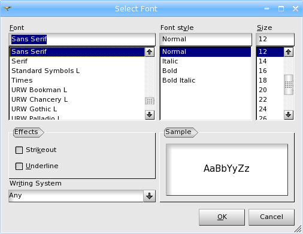

.. _select_color_and_font_page: 

*********************
Select Color and Font
*********************

.. _select_color_dlg:

Select Color Dialog
===================

**Select Color** and **Select Font** menus are used in many
Preferences.

Select color
############

This menu  allows to choose from either predefined **Basic Colors**
grouped in the upper left corner of the window or **Custom Colors**, which
you can define yourselves. To define a Custom Color, click on one of
the Custom Color cells, select the color you need in the field of
colors or by typing in its numeric parameters in the lower right
corner of the window, then click **Add to Custom Colors** button. The
chosen color will be added to **Custom Colors** table.

.. _font_color_dlg:

Select font
###########

This menu provides a wide choice of **Fonts**, **Font Styles** and
**Sizes**. Characters can be underlined or struck out. It is possible to
preview them in the **Sample** window. **Script** dialog-box gives the
possibility to use not only Latin and Latin Extended but also
Cyrillic, Greek, Arabic, Runic and many other subsets.

