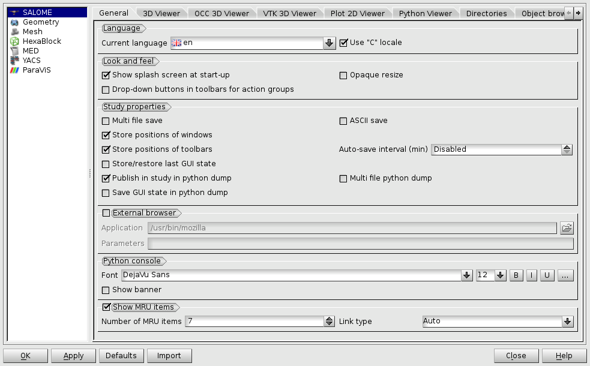
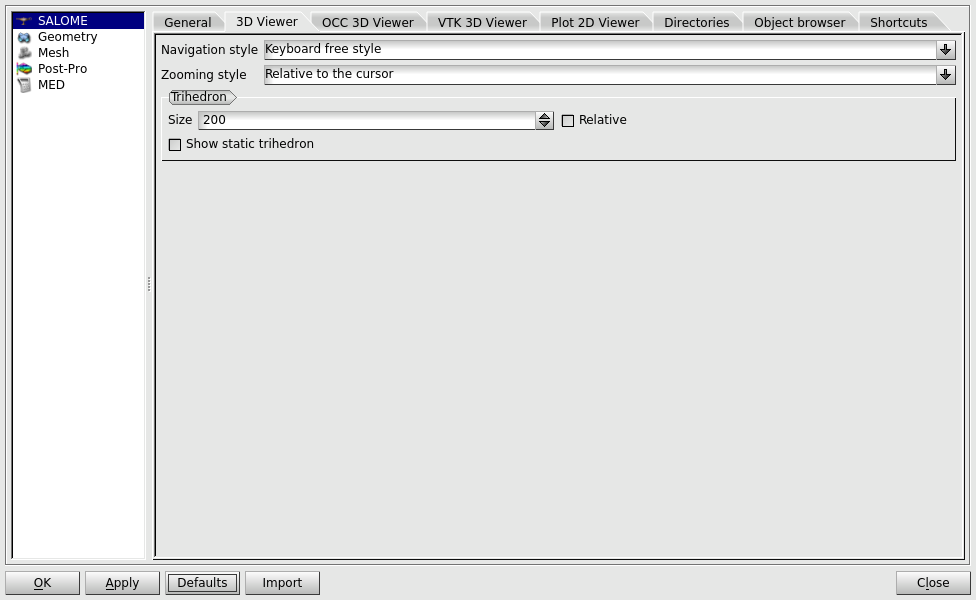
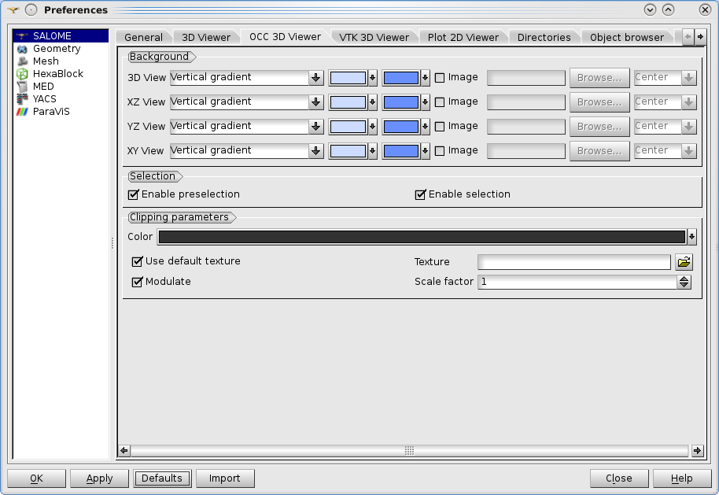
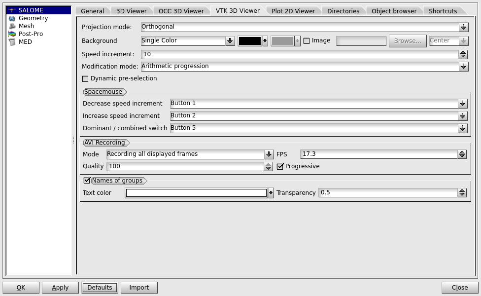
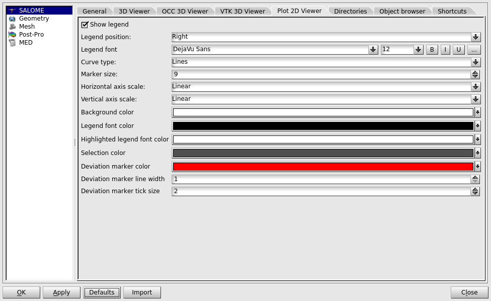
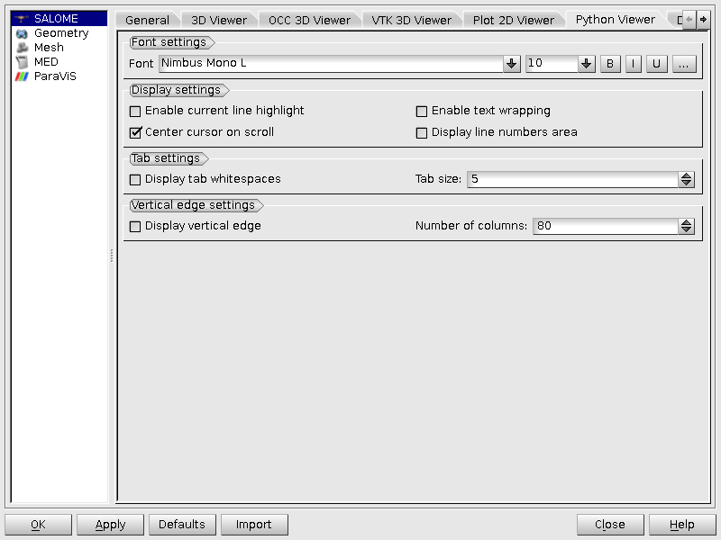
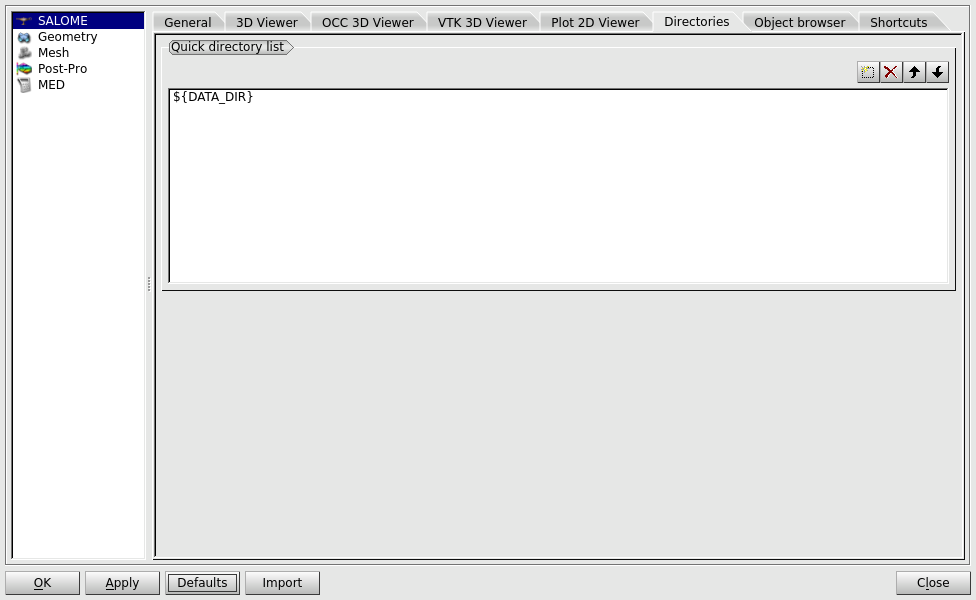
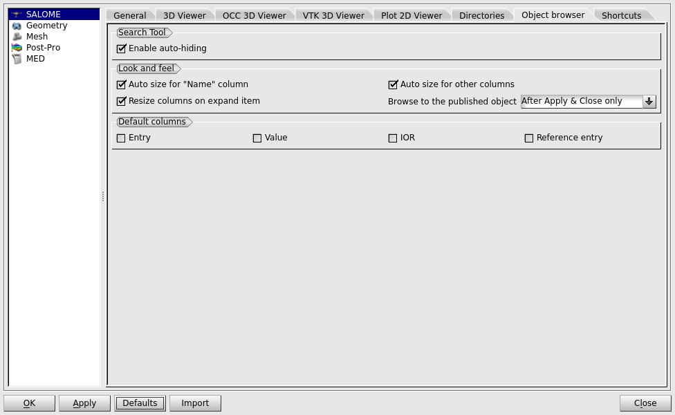
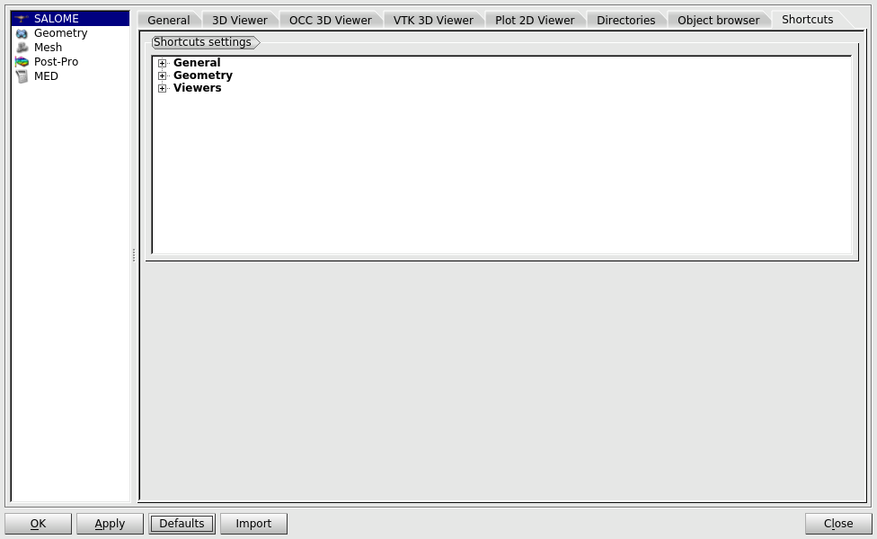
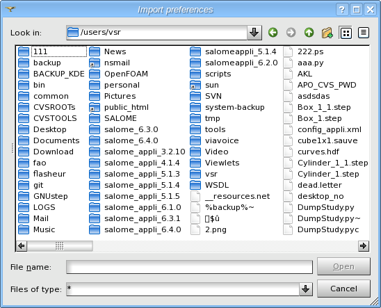

.. _setting_preferences_page: 

*******************
Setting Preferences
*******************

All user preferences of **SALOME** application can be customized using the
common **Preferences** dialog box. This dialog can be open using the
***File > Preferences...*** menu item.

The **Preferences** dialog box consists of two parts:

- Available preferences sections are listed in the left part of the dialog box; usually this list contains "SALOME" item that specifies general application preferences and a separate section for each SALOME module available in the current session.
- The tabbed widget at the right side of the dialog box provides controls that can be used to customize the preferences.

.. note:: The preferences for modules become accessible only after explicit loading of these modules. Until then the dialog box will show the corresponding warning message. 

More detailed information about preferences for certain modules can be found in the User's guide of the corresponding module.

General application preferences are specified in the **SALOME** section
of the **Preferences** dialog box. These preferences affect on the
application look-n-feel and common functionality.

If the study has just been started and other
modules have not been loaded yet, it will be possible to change only the settings which refer to
the whole GUI SALOME session. 

General Preferences
###################

- **Language**

  - **Current language** - the language used by the application GUI. The language change will come in force only after the application is restarted.
  - **Use C locale**  - when checked, the C locale will be set for the application, otherwise a system locale will be used. The locale change will come in force only after the application is restarted.

- **Look and feel**

  - **Show splash screen at start-up** - allows showing or hiding the splash screen at start-up.
  - **Opaque resize** - force opaque resize mode for viewers area (tabbed workspace). Clear this checkbox for less perfomant workstations.
  - **Drop-down buttons in toolbars for action groups** - when checked, the action groups are represented in the viewer toolbars as a single drop-down button, switchable by the user. Otherwise, all the buttons from the action groups are displayed in the toolbar. 

- **Study Properties**

  - **Multi file save** - if checked in, your study will be saved in several HDF files (one basic HDF file which will store the main information about the saved study and several other files for the data created by each component used during the study session). Opening of this study requires that **ALL** saved files should be stored in the **SAME** directory. If you would like to copy your saved study in another directory or machine, you should copy all stored files. Otherwise, if you try to open this study, some data will be lost and it will lead to invalid functioning of the SALOME platform. 
  - **ASCII save** - if checked in, your study will be saved in ASCII format file (or files).
  - **Automatic loading of light modules when opening study** -  if checked in, Light Modules of the current study will be automatically loaded at the next study opening, allowing completion of object browser.
  - **Store positions of windows** -  if checked in, positions of windows will be saved in a special file at the end of the current session and then restored for a new session.
  - **Store positions of toolbars** -  if checked in, positions of toolbars will be saved in a special file at the end of the current session and then restored for a new session.
  - **Auto-save interval (min)** - allows to specify the time interval (in minutes) for automatic study saving operation. If the time interval is equal to 0 ("Disabled" value is shown) the automatic saving is not performed.
  - **Store/restore last GUI state** - if checked in, all GUI settings are saved with the rest of the data whenever you save the study. When the study is reopened, the GUI state is restored.
  - **Publish in study in python dump** - if this option is switched on, the Python script resulting from Dump Python operation will include commands related to the publication of the data in the study (if this option is supported by specific module).
  - **Multi file python dump** - allows to generate multiple files (separately for each component) for dumping of a study to a python script. If the option is disabled, the study is dumped to a single python script.
  - **Save GUI state in python dump** - if this option is switched on, the Python script resulting from Dump Python operation will include commands related to the GUI state.

- **External browser** - allows to define what browser will be used to show SALOME reference manuals: internal (built-in SALOME browser) or external (IE, Netscape, Mozilla, ...). In addition, it is possible to specify 

    - **Application** - this option allows you to set an external browser (IE, Netscape) which will be used for viewing SALOME reference manuals. By default, Mozilla is used.
    - **Parameters** - additional parameters required for launching of the external browser (if applicable).

- **Python console**

    - **Font** - allows quickly setting the parameters (style, size, face) of the :ref:`font_color_dlg` used in embedded Python console.
    - **Show banner** - this option allows to show/hide the Python banner on top of the console window.

- **Show MRU items** - allows to define the maximum **Number** of items in **Most Recently Used** list and the **Link type**: 

  - **Long** - shows the full path to the file. 
  - **Short** - shows the file name only.
  - **Auto** - shows full paths to the files only if some files from different locations have the same name.

- **Full-screen** 

  - **Hide object browser and viewers toolbars** - switches automatic hiding of Object Browser and OCC viewer toolbar in full-screen mode.

3D Viewer Preferences
#####################

- **Navigation style** - this option allows to choose one of the modes of work with mouse in OCC and VTK 3D viewers.

  - **Salome Standard Controls** - allows to manipulate objects in the viewer with the mouse and locked Ctrl button: increase or decrease the zoom ratio with the left mouse button, translate object in any direction with the central mouse button or rotate it with the right mouse button.
  - **Keyboard Free** - allows to manipulate objects in the viewer with the mouse without locking Ctrl button. In this case the operations are assigned to the buttons differently: rotation is made with the left button, translation with the right and zoom with both pressed in the same time.

- **Zooming style** - this option allows to choose a zooming mode.

  - **Relative to the view's center** - allows to zoom the view relatively to its center.
  - **Relative to the cursor** - allows to zoom the view relatively to the current cursor position.

- **Trihedron** - viewer trihedron settings:

  - **Size** - size of the coordinate axes (global trihedron) displayed in the viewer.
  - **Relative** - if this option is switched on, trihedron axes scale to fit the size of the scene displayed in 3D viewer.
  - **Show static trihedron** - allows to show/hide the static mini-trihedron located in the bottom-left corner of the viewer.

.. _occ_preferences:

OCC 3D Viewer Preferences
#########################

- **Projection mode** - sets the default projection mode for the viewers: Orthogonal or Perpective.
- **Stereo render** - stereoscopic view settings:

  - **Stereo type** - specifies a stereo pair type:

    - Shutter glasses (OpenGL quad-buffer)
    - Anaglyph
    - Row-interlaced
    - Column-interlaced
    - Chess-board stereo for DLP TVs
    - Horizontal-anamorphic (side-by-side)
    - Vertical-anamorphic (Half OverUnder)

    .. note::
		The stereo pair type selected in this combobox is applied for all existing OCC 3D views with stereo rendering already turned on within the same SALOME GUI session. It is not possible to use different stereo modes in several OCC 3D views at the same time within the same SALOME GUI session.

  - **Anaglyph filter** - specifies the format of anaglyph stereo pair:

    - Red-Cyan (default)
    - Yellow-Blue
    - Green-Magenta

  - **Convergence distance type**: Absolute or Relative (default).
  - **Stereographic focus value** - 1 by default.
  - **IOD type** - Absolute or Relative (default).
  - **Interocular distance (IOD) value** - 0.05 by default.
  - **Reverse stereo** - option to swap left and right frames.
  - **Enable V-Sync** - activates vertical synchronization.
  - **Enable quad-buffer support** - allows quad-buffered rendering.

  .. note:: 
	It is neccessary to enable quad-buffered stereoscopic rendering manually in graphic driver settings. SALOME does not do it automatically.

  .. note:: 
	All existing OCC 3D views should be re-created for quad-buffer support.

- **Background** - specifies the default background for the viewers, separately for (for more details, refer to the :ref:`viewer_background` page"):

  - **3D View**
  - **XZ View**
  - **YZ View**
  - **XY View**

- **Selection**

  - **Enable preselection** - switches preselection on/off.
  - **Enable selection** - switches selection on/off.

- **Clipping parameters** - specifies the default clipping plane parameters.

  - **Color** - allows to change the color of the clipped region.
  - **Use default texture** - if this option is switched on, the default texture will be used for clipping texture, otherwise - the texture specified in "Texture" field.
  - **Texture** - allows to change the texture of the clipped region (enable if "Use default texture" is switched off).
  - **Modulate** - controls if "Texture" should be mixed with "Color" parameter or not.
  - **Scale factor** - sets the scale factor for default and custom textures.

- **Ray tracing** - specifies the default GPU ray-tracing parameters.

  - **Depth** - defines maximum ray-tracing depth.
  - **Specular reflections** - enables/disables specular reflections.
  - **Adaptive anti-aliasing** - enables/disables adaptive anti-aliasing.
  - **Shadows rendering** - enables/disables shadows rendering.
  - **Transparent shadow** - enables/disables light propagation through transparent media.

- **Light source** - allows to set default parameters for directional light source.

  - **Color** - allows to change the color of light source.
  - **Dx, Dy, Dz** - sets direction coordinates.

.. _vtk_preferences:

VTK 3D Viewer Preferences
#########################

- **Projection mode** - allows choosing between **Orthogonal** and **Perspective** projection mode.
- **Background** - specifies the default background for the viewer; for more details, refer to the :ref:`viewer_background`.
- **Speed Increment** - defines the number of units by which the speed increases or respectively decreases after pressing [+] or [-] keyboard buttons.
- **Modification Mode** - allows choosing between **Arithmetic** and **Geometrical** progression used for zooming.
- **Stereo render** - stereoscopic view settings:

  - **Stereo type** - specifies a stereo pair type:

    - Crystal Eyes
    - Red-Blue
    - Interlaced
    - Left
    - Right
    - Dresden
    - Anaglyph
    - Checkerboard
    - Split View Port Horizontal

    .. note:: 
		The stereo pair type selected in this combobox is applied for all existing VTK 3D views with stereo rendering already turned on within the same SALOME GUI session. It is not possible to use different stereo modes in several VTK 3D views at the same time within the same SALOME GUI session.

  - **Anaglyph filter** - specifies the format of anaglyph stereo pair:

    - Red-Cyan (default)
    - Yellow-Blue
    - Green-Magenta

  - **Enable quad-buffer support** - allows quad-buffered rendering.

  .. note:: 
		It is neccessary to enable quad-buffered stereoscopic rendering manually in graphic driver settings. SALOME does not do it automatically.
  .. note:: 
		All existing VTK 3D views should be re-created for quad-buffer support.

- **Selection**

  - **Preselection** - allows to choose among three possible preselection modes:

    - **Standard** - this mode works quickly, by checking only bounding boxes of objects. It does not deal with the order of actors in the view or with their data (points/ cells).
    - **Dynamic** - works directly with cells of actors, which provides the exact area of preselection. This mode is much more slower. 
    - **Disabled** - switches off the preselection.

  - **Enable selection** - switches selection on/off.

- **Spacemouse** - a mouse-like manipulator device specially designed for working with 3D presentations, objects, etc. You can reassign the actions listed below to any of its buttons.

  - **Decrease Speed Increment** - decreases by 1 the speed increment used for the keyboard (same as [-] key).
  - **Increase Speed Increment** - increase by 1 the speed increment used for the keyboard (same as [+] key).
  - **Dominant / combined switch** - toggles button to switch to dominant or combined movements. 

- **AVI Recording**

  - **Mode** - allows to choose from two recording regimes:

    - **Recording all displayed frames** - records exactly at the FPS rate specified by the user. 
    - **Recording at a given FPS** - records only when the contents of the viewer change (some activity is performed).  In the AVI file non-recorded images are substituted with the copies of the latest recorded image, which produces files with lower quality but requires less system resources.

  - **FPS** - allows to define the FPS (frames per second) rate for the clip. Set greater value for better quality.
  - **Quality** - allows to set the quality of the clip in the interval between 0 and 100.
  - **Progressive** - allows to record a progressive API file.

- **Names of groups** - allows to specify parameters of the titles displayed in the viewer:

  - **Text color** - allows selecting the text color;
  - **Transparency** - allows selecting the text transparency.

.. _plot2d_preferences:

Plot 2D Viewer Preferences
##########################

- **Background color** - this submenu allows to select the background color. Click on the colored line to access to the :ref:`select_color_and_font_page` dialog box.
- **Selection color** - this submenu allows to select the color of selected object in the viewer. 
- **Viewer** - allows specifying the properties of the Plot 2D Viewer.

  - **Curve Type** - this allows to set the representation of graphs in your presentations. You can see only **Points**, points connected with **Lines** or points connected with smooth **Splines**.
  - **Marker Size** - this submenu allows you to set the size of markers in your graphs.
  - **Horizontal** and **Vertical axis scale** - this submenus allow you to set the scale for vertical and horizontal axes. It can be either **Linear** or **Logarithmic**. Note that the **Logarithmic** scale can be used only if the minimum value of corresponding component (abscissa or ordinate) of all points displayed in the viewer is greater than zero. If this condition is not met, the scale is switched to **Linear** automatically, even if it is set to **Logarithmic**.
  - **Deviation marker color** - this submenu allows to select the color of the deviation marker. 
  - **Deviation marker line width** allows to define line width of the deviation marker. 
  - **Deviation marker tick size** allows to define size of the upper and lower horizontal lines of the deviation marker. 

- **Legend** - allows specifying the properties of the legend.

  - **Show legend** - this options specifies if it's necessary to show legend by default.
  - **Legend Position** - this submenu allows to set the default position of the legend, it can be located to the left, to the right, on top or on bottom of the graph.
  - **Symbol type** you can select the type of legend item symbol from "Marker on line" or "Marker above line"
  - **Legend font** - this allows to set type and face for the font of Legend item.
  - **Legend font color** - this allows to select the color of the font of the legend item. 
  - **Highlighted legend font color** - this submenu allows to select the color of the font of the selected legend item. 

.. _default_python_preferences:

Python Viewer Preferences
#########################

.. note:: 
	The following settings are default and will be applied only for newly created Python viewers. Customization of already opened viewers can be done using local :ref:`custom_python_preferences` called by clicking on the corresponding icon of :ref:`python_viewer_page`.

- **Font settings** allows setting font variant, size and style.
- **Display settings** specifies the script representation in the viewer:

  - **Enable current line highlight** switches on background coloring of the current line.
  - **Enable text wrapping** wraps lines at the view border of the editor.
  - **Center cursor on scroll** scrolls the script vertically to make the cursor visible at the center of the viewer.
  - **Display line numbers area** shows a panel with line numbers of the script at the left border of the editor.

- **Tab settings** allows displaying tab indentation as a certain number of white-spaces.
- **Vertical edge settings** manages drawing of a vertical line at the specified column of the viewer.

Directories Preferences
#######################

- **Quick Directory List** - this section allows to create and manage a custom quick directory list. To add a directory in the list, press the "Add directory" button:

then the **"..."** button and browse the data tree for the directory you need.
The "Up" and "Down" buttons(see the picture below) help you to sort the directories in the list:

To remove the selected directory from the list, press the "Delete"
button:

Object Browser Preferences
##########################

- **Search Tool** - specifies behavior of the :ref:`using_find_tool_page`.

  - **Enable auto-hiding** checkbox - hides the search tool automatically after short perioud of time when it is not used.

- **Look and feel**

  - **Auto size for "Name" column** - this checkbox enables automatic resizing for the "Name" column.
  - **Auto size for other columns** - this checkbox enables automatic resizing for the other columns.
  - **Resize columns on expand item** - this checkbox enables resizing columns on expanding an object browser item.
  - **Browse to the published object** - this combobox allows to enable automatic browsing to the objects just published to the study (using GUI dialogs only). It means that the object browser will be scrolled to the published objects, make them visible if they are collapsed and select the first of them. Three modes are allowed for activating this feature:

    - **Never** - automatic browsing is disabled.
    - **After Apply & Close only** - browsing is activated when the dialog is accepted by **Apply & Close** or **Ok** buttons (or if the objects are published without using a dialog, for example, by clicking a context menu button) and not activated when the **Apply** button is pressed and therefore the dialog remains visible.
    - **Always** - automatic browsing is always enabled.

- **Default columns** - these checkboxes allow to display or hide **Value**, **Entry**, **IOR** and **Reference entry** columns in the Object Browser.

Shortcuts Preferences
#####################

- **Shortcuts settings** widget allows to define custom shortcuts for various operations. To change keyboard sequence for a certain action - select the action and press the custom keys combination.

:ref:`select_color_and_font_page`: "Font and color preferences"
are most oftenly used types of user settings.

When you change settings (click **OK** or **Apply** button) each module
receives the notification about what preferences are changed. You can
also click **Defaults** button to restore default preferences or **Close**
button to quit the dialog box without any changes. 

**Import** button allows loading specific user file containing
preferences from any location at the computer through a standard
Import dialog box.

The preferences files usually have \*.xml extension. Also,
preferences files automatically saved by the application (stored in the
~/.config/salome directory) have no extension and by default start with
.SalomeApprc. followed by SALOME version number. Usually there is a
separate preferences file for each SALOME version in use. Preferences
are saved to the file in the end of the working session and restored
at the application start-up.

.. note:: 
	The preferences you set will be default preferences for all **new** objects, but they are not retroactive and do not automatically apply to the existing objects.

.. toctree::
	:maxdepth: 2

        select_color_and_font.rst
