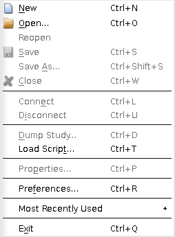
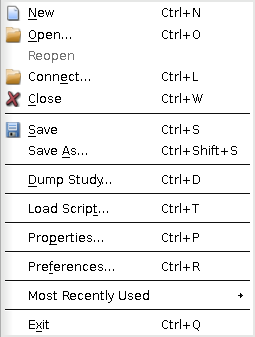
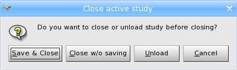
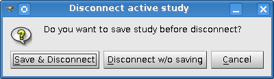
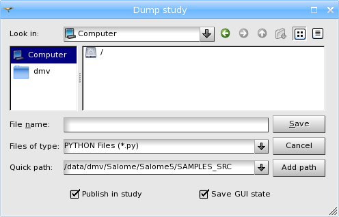
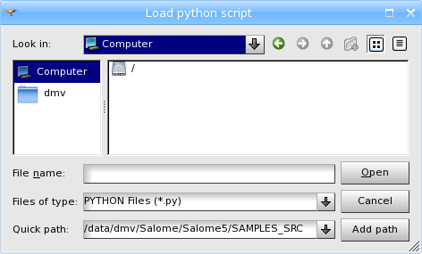
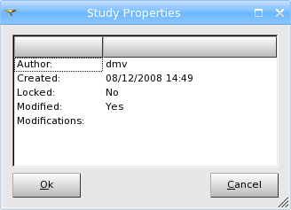

.. _study_management_page: 

****************
Study management
****************

Study is a document within the application, where you can carry out all
operations provided by the SALOME functionality. 
This is a certain abstraction layer between actual
document data (probably, remote data available through CORBA) and data
presentation (in the Object Browser). The study is composed of Data
Object instances, combined into a tree-like structure.

All operations with study are available from the **File** menu.

.. note:: SALOME is a single-study application. It means that only one study can be opened at the moment.

Immediately after the application is launched there is (normally) no active study.
However, you have access to the embedded Python console, that can be used to initialize
a study by means of Python API (see documentation on SALOME KERNEL module for more details).

The following operations are available from the **File** menu:

As soon as a study is created or loaded from a file or a data server,
additional operations become available from the **File** menu:

**New** - creates a new study. The study will be created
with default name **Study1**. If there is an already opened study,
you will be asked to close it before creating new one.

**Open** - allows to open an existing study by browsing for it in a
standard Open File dialog box, choosing the required
*.hdf file and clicking *Open* button.
If there is already opened study, you will be asked to close it
before opening new one.

**Reopen** - reloads the current study from the associated \*.hdf file.
This menu command can be used to reverse the study to the latest saved state.

**Save** - saves the current study. Saving a study you also save its layout, i.e. all positions and sizes
of dockable windows. It means that the difference in settings of the
same windows (for example Python console) is possible between
different modules (the same window can have different size and
position when other module is activated). Also each module can
indicate which common windows are necessary for working, and only they
will be displayed when this module is active.

.. note:: If the study hasn't been previously saved, **Save** will call the standard Save File dialog box where you can enter the name for your study and save it.

**Save as** - allows to save the current study with a new name.
Input a new name for the study in the standard
Search File dialog box and click *Save* button.

**Close** - closes the current study; alternatively closing of the study
can be done by clicking on the cross in the upper right corner of the desktop window.

.. note:: If the study has not been previously saved, you will be prompted by the following dialog box with several options:

**Connect** - allows to open an unloaded or created outside GUI study.

.. note:: Connect is available only if there is an opened study on the data server.

**Disconnect** - unloads the current study from the desktop. The study stays opened
in the data server; it can be then reloaded in the same working session
(using **Connect** operation), but if you quit SALOME application, all changes in the
unloaded study can be lost.

.. note:: If the study has not been previously saved, you will be prompted by the following dialog box with several options:

**Dump study** - allows to Dump a SALOME Study in one or several
Python scripts. The following dialog box allows to browse for the location and
define the name for a Python file.

* **Publish in study** - if checked in, the component objects created by Python commands will be published in the created Study when the script is played, otherwise the objects will not be published in the Study.

* **Save GUI state** - if checked in, the current application layout will be saved in the Python file.

To confirm your choice click *Save*.

**Load Script** - allows to load a saved Python Script.

To confirm your choice click *Open*.

**Properties** - allows to show/edit the properties of the current study.

* **Author** - allows to change the name of the study author.
* **Creation date** - gives the date and time of Study creation.
* **Locked** - allows to lock the study for modifications. In case if **Locked** checkbox is checked your study will be locked for any modifications for all users. Next time you try to edit it, you will see the following warning message:

	.. image:: ../images/lockedstudy.png 
        	:align: center

* **Modified/Not Modified** - allows to see if any modifications have been introduced into study since its last save. 
* **Length units** - allows to change the units of the study.
* **Comment** - allows to add arbitrary comment for the study.
* **Modifications** - allows to  view the list of changes made in the study. Each record contains the date and time of the modification and the name of the user, who has introduced it.
* **Stored data** - Shows the versions of data currently stored in the study. Note, that this information does not concern the current versions of SALOME modules, it shows the version in which the data has been initially created. If the study is re-saved in the version of SALOME, different from the initial one, the version information is highlighted by the red-colored font, which means that the version information is not actually valid.

**Preferences** - allows :ref:`setting_preferences_page` applicable to Salome in general and its modules.

**Most recently used** - contains a list of recently opened
studies, giving the possibility to fast load the required study.

**Exit** - unlike **Close**, closes not only the current, but all opened
Salome studies.

