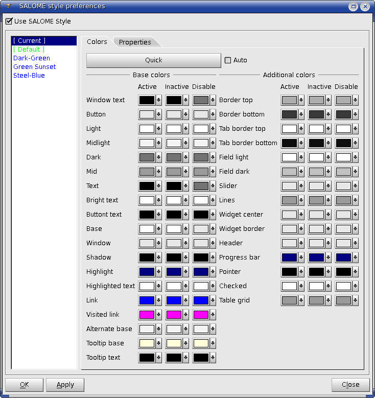
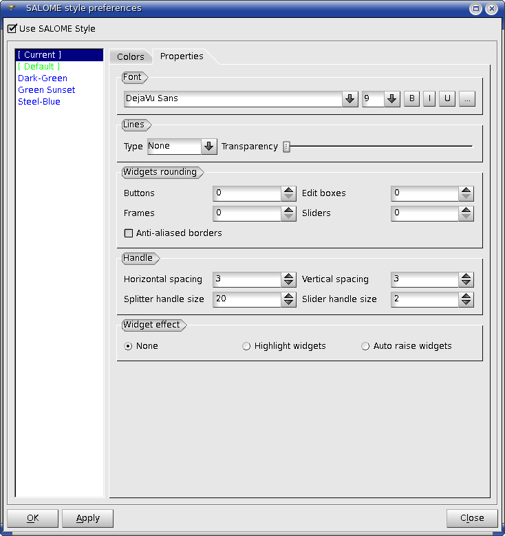

.. _themes_page: 

*****
Theme
***** 

The look and feel of the SALOME desktop can be customized by the user
via SALOME style preferences.

**SALOME style prefereces** dialog box is used for customization of
the look and feel of SALOME style. To open it, select in the Main menu
**View -> Theme** item.

It is possible to choose a predefined scheme in the list to the left
or to create a custom scheme using the controls to the right.

The dialog box contains two pages.

The first page allows specifying the color palette.
- **Quick** button allows automatic color palette definition basing on
the main color specified by the user.

The second page allows specifying different properties of the theme:

- **Font** group allows to edit the font used in menus, dialog boxes, etc.
- **Lines** group allows to apply dashing to Salome elements.
- **Widgets rounding** allows to round corners of Salome dialog boxes and define their parameters.
- **Handle** allows to define parameters of the handle.
- **Widget effect** allows to apply special effects to Salome dialog boxes.

If SALOME Theme is not used (**Use SALOME Style** checkbox is
switched off), the global system settings are applied (for
example, KDE settings). So, the look and feel of the application (for
example, palette and/or font) can be customized by using the Qt utility
*qtconfig*.

