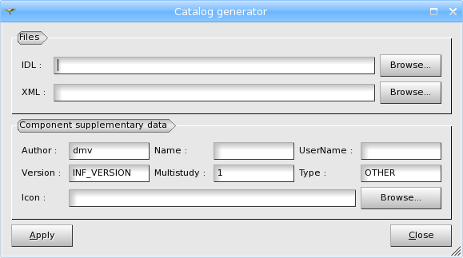

.. _using_catalog_generator_page: 

***********************
Using Catalog Generator
***********************

SALOME platform is an open platform for
integration of your custom components, which can used in the same way
as typical modules provided in the standard installed package. The
**Catalog Generator** tool serves for implementation of the interface of
your custom component. It allows to generate from IDL description of
your component interface its xml description.  The component xml
description allows SALOME application to know about the component and
its services and provides the possibility to call the component
services, for example, inside Supervisor module.

If you have a look at runSalome,
runSalomeWithPort scripts running SALOME application, which are stored
in build/bin directory you will see that SALOME_ModuleCatalog_Server
is started with two xml files as its input parameters:
**CatalogModuleGeneral.xml** and **CatalogModulePersonnel.xml**. These two
files store the descriptions of interfaces and services of all
components, provided with typical SALOME package. To add a new
component into SALOME platform you should either update one of these
existing xml files with generated xml description of your component or
create a new one.

*To open the Catalog Generator:*

From the main menu choose **Tools > Catalog Generator**, the following
dialog box will appear:

In this dialog box you can specify:

* Name and location of the IDL file describing the interface of your component (Click the **Browse** button to find it using the data tree).
* Name and location of an existing XML file, which will be updated with the interface of you component or name and desired location of a new XML file, which will be generated (Click the **Browse** button to find it using the data tree).
* Name of the author.
* Name of the component.
* Name of the user.
* Version.
* Capability of multi study support.
* Type of the component.
* Icon of your component (Click the **Browse** button to find it using the data tree).

.. note:: 
	If you have chosen to create a new xml file containing the description of your component, don't forget to specify it as input parameter for SALOME_ModuleCatalog_Server in the file, you are using as a running script of SALOME platform (in runSalomeWithPort, for example).

When launching SALOME next time you will see your module alongside other components.

**Tip:** You can use the **Catalog Generator** tool, if you would like to 
**test** the functionality of your new component. After implementation of
your component interface, launch SUPERVISION module where you can try
using the services of your new component. (see also: Adding factory
nodes)

