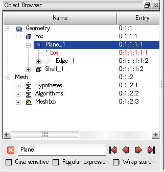
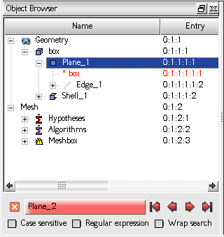

.. _using_find_tool_page: 

***************
Using Find Tool
***************

The **Object Browser** is supplied with the **Find** toolbox. This tool
allows performing context search of the items in the Object Browser:

The **Find** toolbox can be invoked in several ways:

- Pressing :kbd:`Ctrl-F` key combination starts a new search; the text previously input by the user in the edit control of the **Find** toolbox is automatically selected.
- Pressing :kbd:`/` (slash) key starts a new search; the text previously input by the user is cleared.
- Pressing :kbd:`F3` key repeats the previous search in the forward direction (from top to bottom).
- Pressing :kbd:`Shift-F3` key repeats the previous search in the backward direction (from bottom to top).
- Activating *Find* command from the Object Browser context popup menu starts a new search (the same as :kbd:`Ctrl-F`).

Pressing :kbd:`Escape` key closes the **Find** toolbox.

The search is always started from the first selected item in
the Object Browser. If there are no selected items, the search is
started from the top of the Object Browser contents. If there is an
item which satisfies the search conditions, it is selected and the
Object Browser is expanded to show this item (if it is collapsed).

The **Find** toolbox provides a set of widgets which are used to
perform the search operations or change the search conditions:

- *"Close"* button closes the **Find** toolbox.
- Line edit box is used to input the searched text. Note that the search is always done by the object name, i.e. by the data displayed in the "Name" column of the Object Browser.
- *"Find first item"* button searches the very first item which satisfies the search conditions.
- *"Find previous item"* button searches the previous item which satisfies the search conditions.
- *"Find next item"* button searches the next item which satisfies the search conditions.
- *"Find last item"* button searches the very last item which satisfies the search conditions.
- *"Case sensitive"* check box allows performing case sensitive search.
- *"Regular Expression"* check box allows performing the search of the items by the regular expression, for example:

  - *Face* - matches all faces
  - *Face_[\\d]* - matches Face_1, Face_2, etc.. (all faces)
  - *Face_[\\d]$* - matches Face_1, Face_2, but does not match Face_11, Face_12.
  - *^Face_[\\d]$* - the same as above
  - *^ Face_[\\d]$* - matches nothing

- *"Wrap search"* check box: if checked and the search reaches the last item, satisfying the search conditions, pressing *"Find Next"* button moves the selection to the very first item which matches the search conditions (i.e. a cyclic search is performed).

	If there are no items satisfying the search conditions in the Object Browser, the edit control of the **Find** toolbox becomes red-colored:

The **Find** toolbox also has an auto-hiding feature. This works as follows:

- If the input focus is inside the **Find** toolbox, auto-hiding is automatically deactivated.
- If the input focus moves outside the **Find** toolbox, it hides automatically in 10 seconds after the last search operation (which can be done by clicking * "Find Next"*, *"Find Previous"* button, or typing something in the edit field); each new search operation restarts the auto-hide timer.

