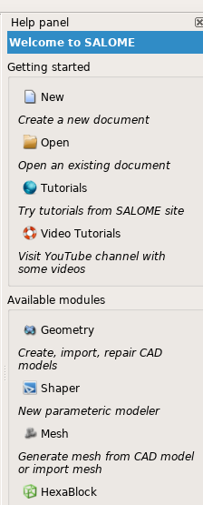

.. _using_help_panel: 

****************
Using Help Panel
****************

.. contents:: Table of Contents

In SALOME, each module can show introduction information and/or context help
in the **Help panel**. This panel is shown in the right dock area of the
SALOME GUI desktop.

.. _hp_show_help_panel:

Show help panel
===============

In order to show *Help panel*, the module must request it in the standard way, in
the ``windows()`` method, for example:

.. code-block:: c++
   :emphasize-lines: 4

    void GeometryGUI::windows(QMap<int, int>& map) const
    {
      map.insert(SalomeApp_Application::WT_ObjectBrowser, Qt::LeftDockWidgetArea);
      map.insert(SalomeApp_Application::WT_InfoPanel, Qt::RightDockWidgetArea);
      map.insert(SalomeApp_Application::WT_NoteBook, Qt::LeftDockWidgetArea);
      map.insert(SalomeApp_Application::WT_PyConsole, Qt::BottomDockWidgetArea);
    }

.. note:: The dock area position flag is ignored for the *Help panel*.

.. _hp_module_description:

Module description
==================

To display short annotation of the module in the desktop in the application's
*neutral point* (when there's no active module, see figure above),
add the ``<description>`` parameter to the main module's section in the configuration
file - ``LightApp.xml`` or ``SalomeApp.xml``, for example:

.. code-block:: xml
   :emphasize-lines: 6

    <document>
      <section name="SMESH">
        <parameter name="name" value="Mesh"/>
        <parameter name="icon" value="ModuleMesh.png"/>
        <parameter name="version" value="9.6.0"/>
        <parameter name="description" value="Generate mesh from CAD model or import mesh"/>
      </section>
    </document>

Also, provide a translation of the module description to other languages in the
corresponding translation files (``*.ts``).

.. _hp_api:

API of Help panel
=================

.. _hp_api_cpp:

C++
---

Help panel is implemented in SALOME GUI module, via the ``QtxInfoPanel`` class.
To obtain a reference to the Help panel, use method ``infoPanel()`` of the
``LightApp_Application`` or ``SalomeApp_Application`` class:

.. code-block:: c++

    #include <QtxInfoPanel.h>
    ...
    SalomeApp_Application* app = dynamic_cast<SalomeApp_Application*>(application());
    QtxInfoPanel* ip = app->infoPanel();

The class ``QtxInfoPanel`` provides several methods which can be used to manage
content of the *Help panel*. It is possible to add text labels and actions (these latter
are presented as buttons). The items can be arranged into the logical blocks - groups;
groups can contain other groups. All methods creating content items return unique
identifier which can be later used to change item's visibility, enable/disable it
(actions can be also enabled/disable directly), remove it or clear its contents
(for groups). Top level container has identifier ``-1``.

.. code-block:: c++

    // Set panel's title (put empty string to hide title)
    ip->setTitle("Welcome to my module");

    // Create group box	
    int gb = ip->addGroup("General features");

    // Add action to the group box
    QAction* action = new QAction("My feature");
    int id1 = ip->addAction(action, gb);

    // Add informative label to the group box
    int id2 = ip->addLabel("My cool feature", gb);

    // Add another label, right-aligned, to the top-level container
    int id3 = ip->addLabel("Some information", Qt::AlignRight);

    // Change visibility of given item
    ip->setVisible(id3, false);

    // Enable/disable given item
    ip->setEnabled(gb, false);

    // Remove given item
    ip->remove(id1);

    // Remove all content of group
    ip->clear(gb);

    // Clear Help panel
    ip->clear();

.. _hp_api_python:

Python
------

For Python modules, *Help panel* can be accessed via the ``SalomePyQt`` Python module.

.. code-block:: python

    from PyQt5 import Qt as Q
    from SalomePyQt import SalomePyQt as sg

    # Set panel's title (put empty string to hide title)
    sg.infoSetTitle("Welcome to my module")

    # Create group box	
    gb = sg.infoAddGroup("General features")

    # Add action to the group box
    action = Q.QAction("My feature")
    id1 = sg.infoAddAction(action, gb)

    # Add informative label to the group box
    id2 = sg.infoAddLabel("My cool feature", gb)

    # Add another label, right-aligned, to the top-level container
    # Note: -1 is used explicitly as group identifier
    id3 = sg.infoAddLabel("Some information", Q.Qt.AlignRight, -1)

    # Change visibility of given item
    sg.infoSetVisible(id3, False)

    # Enable/disable given item
    sg.infoSetEnabled(gb, False)

    # Remove given item
    sg.infoRemove(id1)

    # Remove all content of group
    sg.infoClear(gb)

    # Clear Help panel
    sg.infoClear()

.. _hp_update_panel

Notifications
=============

Each time when *Help panel* is shown, currently active module is informed via
the virtual method ``updateInfoPanel()``. This method can be used to properly
update the contents of the *Help panel*, depending on the current context.
