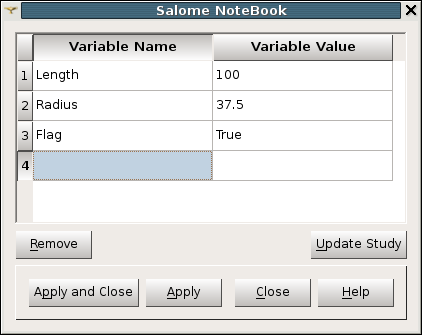

.. _using_notebook: 

**************
Using NoteBook
**************

SALOME **NoteBook** allows to predefine numerical and boolean
parameters (variables).

By default, the **NoteBook** is located in a tabbed widget to the left (shared with the Object Browser).

To hide/show this tab choose **View > Windows > Notebook**.

Here you can add new variables, remove and rename existing variables and 
change their values.

If you have modified some variables, which are already used in the current
study, you should click **Update Study** button to apply your changes
to the study.

.. note:: 
	The study can not be updated until at least one of the variables in the table has an invalid name or value (marked by red color). The names of variables should be unique and their values should be numerical (integer or double) or boolean ("True" / "False").

Here is an example of setting variables in python scripts:

.. code-block:: python
   :linenos:

	import salome_notebook

	notebook = salome_notebook.notebook

	notebook.set("Length", 100)
	notebook.set("Radius", 37.5)
	notebook.set("Flag", True)

Later these values can be used as parameters for any operations in
various components.

