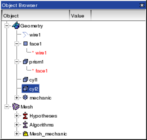
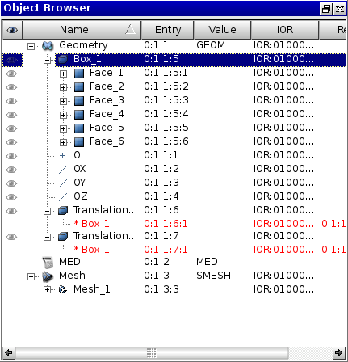

.. _using_object_browser_page: 

********************
Using Object Browser
********************

The **Object Browser** in SALOME is destined for displaying the
structure of the current study in a tree-like form. It contains:

* components, loaded during the current session
* objects created with the help of different components (The objects created with the help of a definite component are located in the folder having the name of this component)
* references to different objects (they are highlighted in red)

.. note:: 
	The **Object Browser** is destined to getting quick access to different objects created during SALOME session. All pop-up menus associated with the objects displayed in the Object Browser are context-sensitive. So it depends on a definite currently loaded SALOME component what options you will see in the pop-up menu, if you right-click on a definite object in the Object Browser.

The Object Browser may contain supplementary attributes of the objects
displayed in additional columns. By default, these columns are not
displayed -  displaying/hiding these columns is possible through
:ref:`setting_preferences_page` or right-clicking on the attributes bar and toggling the necessary
attributes.

- **Name**; 
- **Entry**  - Identification index of the object in the structure of the study;
- **IOR** -  Interoperable Object Reference; 
- **Reference entry**  -  Identification index of the references to the objects;
- **Value**  -  Displays the value of the first object attribute.

.. note:: **Entry, IOR and Reference entry** attributes are displayed for debugging purposes only.

Sorting 
#######

By default the objects in the object browser are sorted in the creation order. 

However, it is possible to enable sorting in the alphabetical order (or the reverse alphabetical order) by right clicking in the header of the tree (near the **Name** field) and checking "enable sorting" in the context menu.

It is possible to use the arrow near "Name" to reverse the order.

If "enable sorting" is unchecked, the objects are sorted in the default order again.

