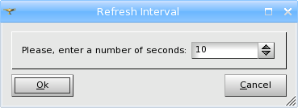
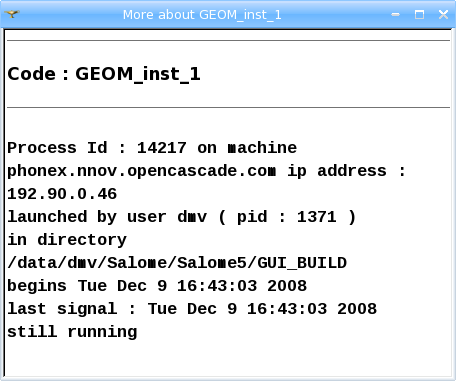

.. _using_registry_tool_page: 

*******************
Using Registry tool
*******************

**Registry** tool is in the SALOME platform is destined for providing
information about the processes (components), which have ever been
launched in the current study session.

*To view the Registry:*

From the main menu choose **Tools > Registry display**, the
following dialog box will appear:

.. image:: ../images/registry1.png
	:align: center

**Running** tab of this dialog box displays a list of the currently
started processes (components) with supplementary information on each
of them divided into columns:

* **Component:** name of the started component
* **PID:** process identification number
* **User Name:** name of the user launching the component
* **Machine:** name of the machine, on which the process has been started
* **begins:** date and time of the starting of the component
* **hello:** date and time of the last call to the component

**History** tab displays a list of all processes, which have ever been
launched within this study session. It contains the same supplementary
information on each of the processes (components).

**Refresh** button allows to refresh the current list of processes
(components).

**Interval** button allows to set an interval for refreshment of the
current list of processes (components).

*To display complete information on a definite process (component):*

Double-click on this process (component). The following window will appear:

