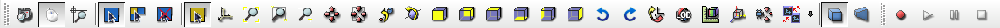
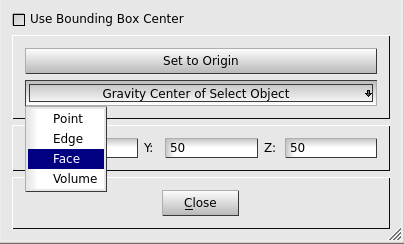
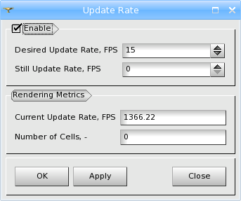
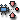
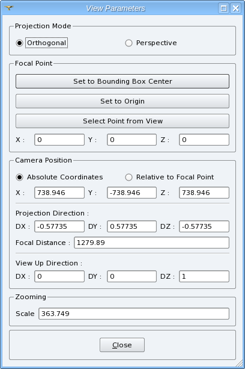
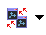

.. _vtk_3d_viewer_page:

*************
VTK 3D Viewer
*************

Operations
##########

The functionalities of VTK viewer are available via its Viewer
Toolbar. Buttons marked with small downward triangles have extended
functionality, which can be accessed by locking on them with left mouse
button.

____

.. image:: ../../../../src/VTKViewer/resources/vtk_view_camera_dump.png
	:align: center

**Dump View** - exports an object snap-shot from the viewer in bmp, png or jpeg image format.

____

.. image:: ../../../../src/SVTK/resources/vtk_view_style_switch.png
	:align: center

**Interaction style switch** - allows to switch between "Salome
standard controls" and "Keyboard free" :ref:`viewer_navigation_modes`.

____

.. image:: ../../../../src/SVTK/resources/vtk_view_zooming_style_switch.png
	:align: center

**Zooming style switch** - allows to switch between standard
(zooming at the center of the view) and advanced (zooming at the
current cursor position) zooming styles. The second mode is available
only for parallel (non-perspective) view's mode.

____

.. image:: ../../../../src/SVTK/resources/vtk_view_highlight.png
	:align: center

These buttons allow switching between three pre-selection (highlighting) modes:

- **Static pre-selection mode** - pre-selection is done in terms of bounding boxes;
- **Dynamic pre-selection mode** - pre-selection is done in terms of cells, i.e. an object can be selected by clicking the point/cell belonging to this object. This mode causes some performance loss. It is advisable to switch dynamic pre-selection off to have a good performance on big objects (for example, huge meshes);
- **Disable pre-selection** - pre-selection is disabled.

____

.. image:: ../../../../src/SVTK/resources/vtk_view_selection.png
	:align: center

**Enable/Disable selection** - enables or disables selection in the view.

____

.. image:: ../../../../src/VTKViewer/resources/vtk_view_triedre.png
	:align: center

**Show/Hide Trihedron** - shows or hides coordinate axes.

____

.. image:: ../../../../src/VTKViewer/resources/vtk_view_fitall.png
	:align: center

**Fit all** - scales the presentation so that it could fit within
the Viewer boundaries.

____

.. image:: ../../../../src/VTKViewer/resources/vtk_view_fitarea.png
	:align: center

**Fit area** - resizes the view to place in the visible area only
the contents of a frame drawn with pressed left mouse button.

____

.. image:: ../../../../src/VTKViewer/resources/vtk_view_fitselection.png
	:align: center

**Fit selection** - fits view contents to the current selection.

____

.. image:: ../../../../src/VTKViewer/resources/vtk_view_zoom.png
	:align: center

**Zoom** - allows to zoom in and out.

____

.. image:: ../../../../src/VTKViewer/resources/vtk_view_pan.png
	:align: center

**Panning** - if the represented objects are greater that the
visible area and you do not wish to use **Fit all** functionality,
click on this button to drag the scene to see its remote parts.

____

.. image:: ../../../../src/VTKViewer/resources/vtk_view_glpan.png
	:align: center

**Global panning** - allows to select a point to be the center of
the presentation showing all displayed objects in the visible area.

____

.. image:: ../../../../src/SVTK/resources/vtk_view_rotation_point.png
	:align: center

**Change rotation point** - allows to to choose the point around
which the rotation is performed.

.. image:: ../images/set_rotation_point_dialog1.png
	:align: center

By default the rotation point is located in the Center of the bounding
box of an object.

Unchecking **Use Bounding Box Center** check-box allows you to
define the coordinates of the rotation point manually.

- **Set to Origin** button restores the default rotation point coordinates.

- **Gravity Center of Selected Object** button allows using the gravity center of the object selected in the viewer as the center of the rotation point. When you click this button, you should first choose the type of selectable object: Point, Edge, Face or Solid and only then proceed with selection in the viewer.

____

.. image:: ../../../../src/VTKViewer/resources/vtk_view_rotate.png
	:align: center

**Rotation** - allows to rotate the selected object using the
mouse.

____

.. image:: ../../../../src/VTKViewer/resources/vtk_view_front.png
	:align: center

.. image:: ../../../../src/VTKViewer/resources/vtk_view_back.png
	:align: center

.. image:: ../../../../src/VTKViewer/resources/vtk_view_top.png
	:align: center

.. image:: ../../../../src/VTKViewer/resources/vtk_view_bottom.png
	:align: center

.. image:: ../../../../src/VTKViewer/resources/vtk_view_left.png
	:align: center

.. image:: ../../../../src/VTKViewer/resources/vtk_view_right.png
	:align: center

These buttons orientate the scene strictly about coordinate axes:
**Front**, **Back**, **Top**, **Bottom**, **Left** or **Right** side.

____

.. image:: ../../../../src/VTKViewer/resources/vtk_view_anticlockwise.png
	:align: center

**Rotate counter-clockwise** - rotates view 90 @htmlonly &deg; @endhtmlonly counter-clockwise.

____

.. image:: ../../../../src/VTKViewer/resources/vtk_view_clockwise.png
	:align: center

**Rotate clockwise** - rotates view 90 @htmlonly &deg; @endhtmlonly clockwise.

____

.. image:: ../../../../src/VTKViewer/resources/vtk_view_reset.png
	:align: center

**Reset** - restores the default position (isometric) of objects in
the scene.

____

.. image:: ../../../../src/SVTK/resources/vtk_view_update_rate.png
	:align: center

**Update Rate** - allows to define the Update Rate for the
presentations displayed in the viewer.

- **Desired Update Rate, FPS** - allows to set the target Update Rate

- **Still Update Rate, FPS** - allows to set the Update Rate for the periods when both the user and the application do not perform any actions in the viewer

- **Current Update Rate, FPS** - shows the Update Rate currently available on your configuration

- **Number of Cells** - shows the number of cells currently in display

____

.. image:: ../../../../src/SVTK/resources/vtk_view_scaling.png
	:align: center

**Scaling** - represents objects deformed (stretched or stuffed) along the axes of coordinates.

____

.. image:: ../../../../src/SVTK/resources/vtk_view_graduated_axes.png
	:align: center

**Graduated axes** - allows to define parameters of axes and graduate them.

.. image:: ../images/graduatedaxes1.png
	:align: center

- **Axis name** - if checked the axis name is displayed in the viewer.

  - **Name** - allows to redefine the name of the axis.

  - **Font** - allows to define color and properties of the font of axis name.

- **Labels** - if checked the labels are displayed in the viewer.

  - **Number** - allows to define the number of labels.

  - **Offset** - allows to define the distance between labels.

  - **Font** - allows to define color and properties of the font of labels names.

- **Tick marks** - if checked the tick marks are displayed in the viewer.

  - **Length** - allows to define the length of tick marks.

- **Is visible** - if checked the axis is displayed in the viewer.

____

**Change View Parameters** - this button gives access to the
dialog for customization of various view parameters.

- **Projection Mode** - switches between the **Orthogonal** and **Perspective** projection modes.

- **Focal Point** - allows to specify the focal point of the view

  - **Set to Bounding Box Center** - chooses the center of the bounding box of the current scene as the focal point;
  - **Set to Origin** - chooses the global coordinates system origin as the focal point;
  - **Select Point from View** - allows to specify the focal point by the direct selection of a point in the view window;
  - **X**, **Y**, **Z** - allows to input the coordinates of the focal point directly.

- **Camera Position** - allows to specify the position of the view camera:

  - **Absolute Coordinates** - in absolute coordinates;
  - **Relative to Focal Point** - as a offset to the focal point;
  - **Projection Direction** - allows specify the direction of the projection vector;
  - **Focal Distance** - the focal distance value.

- **View Up Direction** - direction of the "view up" vector.

- **Zooming**

	- **Scale** - the current zoom factor (available in the **Orthogonal mode** only);
	- **View Angle** - the current view angle (available in the **Perspective mode** only).

____

**Synchronize view** - allows to synchronize 3d view
parameters. This button has two states - checked and
unchecked. Clicking on this button opens a drop-down menu listing
compatible 3d views. When a view is selected in the list , the parameters (view point, position, zoom coefficient, etc.) of the current view are synchronized with the selected view (static
synchronization).

In addition, when this button is "checked", the
views are synchronized dynamically, i.e. any zoom, pan, rotate
or other view operation done in one view is automatically applied to the other view.

____

**Orthogonal mode** - Switches the view to the orthogonal mode.

____

.. image:: ../../../../src/SVTK/resources/vtk_view_perspective.png
	:align: center

**Perspective mode** - Switches the view to the perspective mode.

____

These buttons allow recording viewing operations as a video file in
the AVI format using external software (jpeg2yuv):

- **Start recording** - specify parameters and start recording;

- **Pause recording** - suspend recording;

- **Continue recording** - resume recording;

- **Stop recording** - stop recording.

